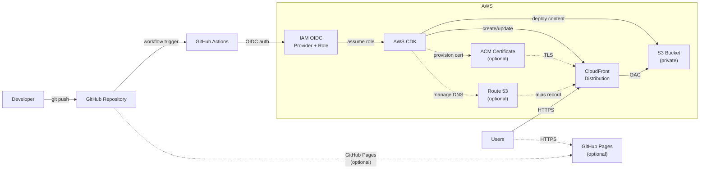

# Static Website Starter Template

A starter template for deploying a static website to [AWS](https://aws.amazon.com/) using [S3](https://aws.amazon.com/s3/) and [CloudFront](https://aws.amazon.com/cloudfront/), provisioned with [AWS CDK](https://aws.amazon.com/cdk/) ([TypeScript](https://www.typescriptlang.org/)).

## Features

- **AWS S3 + CloudFront** for global static site hosting
- **AWS CDK** (TypeScript) for infrastructure as code
- **Custom domain** support with [ACM](https://aws.amazon.com/certificate-manager/) [TLS](https://en.wikipedia.org/wiki/Transport_Layer_Security) certificates
- **[Route 53](https://aws.amazon.com/route53/)** integration for [DNS](https://en.wikipedia.org/wiki/Domain_Name_System) management (optional)
- **[GitHub Actions](https://docs.github.com/en/actions)** workflow with [OIDC](https://docs.github.com/en/actions/security-for-github-actions/security-hardening-your-deployments/about-security-hardening-with-openid-connect) authentication for automated deployment
- **[GitHub Pages](https://pages.github.com/)** as an optional alternative deployment target
- **[React](https://react.dev/) 18** minimal frontend example

## Architecture

Your website files live in the `docs/` directory. When you push changes to GitHub, a GitHub Actions workflow uses **AWS CDK** to deploy them to a private **S3 bucket**. A **CloudFront** [CDN](https://en.wikipedia.org/wiki/Content_delivery_network) distribution sits in front of S3, serving your site to users over [HTTPS](https://en.wikipedia.org/wiki/HTTPS) with low latency worldwide. GitHub Actions authenticates to AWS securely via **OIDC** — no long-lived access keys needed.

Optionally, you can attach a **custom domain** with a TLS certificate from **ACM**, and use **Route 53** for DNS. **GitHub Pages** is also available as a simpler alternative or secondary hosting option.



## Prerequisites

This guide assumes you're on **macOS**. Install each tool in order — later steps depend on earlier ones.

### 1. Homebrew (macOS package manager)

[Homebrew](https://brew.sh/) is used to install most of the tools below. Open **Terminal** (found in Applications → Utilities) and run:

```bash
/bin/bash -c "$(curl -fsSL https://raw.githubusercontent.com/Homebrew/install/HEAD/install.sh)"
```

Follow the on-screen instructions. After installation, verify it works:

```bash
brew --version
```

### 2. Git

Git is the version control system used to manage this repository. macOS includes Git via Xcode Command Line Tools, but you can also install it via Homebrew:

```bash
brew install git
```

Configure your identity (use the email associated with your GitHub account):

```bash
git config --global user.name "Your Name"
git config --global user.email "you@example.com"
```

### 3. GitHub account and GitHub CLI

You'll need a free [GitHub account](https://github.com/signup) to use this template and deploy via GitHub Actions.

The [GitHub CLI](https://cli.github.com/) (`gh`) is used by the included helper script to set deployment secrets. Install and authenticate:

```bash
brew install gh
gh auth login
```

Follow the prompts to authenticate with your GitHub account.

### 4. Node.js

[Node.js](https://nodejs.org/) (v18 or later) is required to run AWS CDK. Install it via Homebrew:

```bash
brew install node
```

Verify the installation:

```bash
node --version   # should print v18 or later
npm --version
```

### 5. AWS account and AWS CLI

You'll need an [AWS account](https://aws.amazon.com/free/) — the free tier covers most resources used by this template.

Install the [AWS CLI](https://aws.amazon.com/cli/) and configure it with your credentials:

```bash
brew install awscli
aws configure
```

`aws configure` will prompt you for:

| Prompt | Value |
|--------|-------|
| AWS Access Key ID | From the IAM console (see below) |
| AWS Secret Access Key | From the IAM console (see below) |
| Default region name | `us-east-1` |
| Default output format | `json` |

To create access keys: open the [IAM console](https://console.aws.amazon.com/iam/) → **Users** → select your user → **Security credentials** → **Create access key**.

### 6. AWS CDK CLI

The [AWS CDK CLI](https://docs.aws.amazon.com/cdk/latest/guide/cli.html) is the command-line tool for deploying infrastructure:

```bash
npm install -g aws-cdk
```

Verify:

```bash
cdk --version
```

### 7. Bootstrap AWS CDK

CDK requires a one-time bootstrap step per AWS account/region. Replace `ACCOUNT-ID` with your [12-digit AWS account ID](https://docs.aws.amazon.com/IAM/latest/UserGuide/console_account-alias.html):

```bash
cdk bootstrap aws://ACCOUNT-ID/us-east-1
```

You can find your account ID by running `aws sts get-caller-identity`.

## Quick Start

1. **Use this template** — Click "Use this template" on GitHub, or clone the repository
2. **Configure** — Edit `infra/cdk.json` context with your settings (see [Configuration](#configuration))
3. **Deploy infrastructure** — `cd infra && npm install && cdk deploy`
4. **Set GitHub secret** — Run `cd infra && ./setup-github-secret.sh` or manually copy `DeployRoleArn` (see [GitHub Actions Setup](#github-actions-setup))
5. **Deploy content** — Push to GitHub and run the "Deploy to AWS" action

## 📁 Repository Structure

```
/
├── .agents/
│   └── skills/
│       └── setup-site/
│           └── SKILL.md         # First-time setup skill for AI agents
├── .github/
│   ├── dependabot.yml           # Dependabot configuration
│   └── workflows/
│       ├── ci.yml                   # CI checks on pull requests
│       └── deploy-aws.yml       # GitHub Action for content deployment
├── docs/                        # Website content (deployed to S3)
│   ├── favicon.svg              # Site favicon
│   └── index.html               # Main landing page
├── infra/                       # AWS CDK infrastructure
│   ├── bin/app.ts               # CDK app entry point
│   ├── lib/static-site-stack.ts # Infrastructure stack
│   ├── cdk.json                 # CDK configuration
│   ├── package.json
│   ├── package-lock.json
│   └── tsconfig.json
├── .gitignore
├── AGENTS.md
├── LICENSE
└── README.md
```

## Infrastructure Setup

### Configuration

Edit `infra/cdk.json` to set your configuration in the `context` section:

| Setting | Required | Description |
|---------|----------|-------------|
| `domainName` | No | Custom domain (e.g., `www.example.com`) |
| `hostedZoneName` | No | Route 53 hosted zone (e.g., `example.com`); enables automatic cert validation and DNS records |
| `certificateArn` | No | Pre-existing ACM certificate ARN (alternative to Route 53 for custom domain) |

Example with a custom domain and Route 53:

```json
{
  "context": {
    "domainName": "www.example.com",
    "hostedZoneName": "example.com"
  }
}
```

### Deploy Infrastructure

```bash
cd infra
npm install
cdk deploy
```

The stack is deployed to **us-east-1** (required for CloudFront + ACM certificate integration). S3 content is served globally via CloudFront regardless of bucket region.

CDK will output the values needed for GitHub Actions:

| CDK Output | Set in GitHub as |
|------------|-----------------|
| `DeployRoleArn` | Secret: `AWS_ROLE_ARN` |

Save this value as a GitHub repository secret so the deployment workflow can authenticate to AWS. See [GitHub Actions Setup](#github-actions-setup) for instructions.

> **Note:** The stack creates a GitHub OIDC identity provider in your AWS account if one doesn't already exist. If a provider is already present (from another project), it will be reused automatically.

### Custom Domain Setup

#### Option A: Using Route 53 (Recommended)

This is the fully automated path. If your domain is registered outside of AWS, you first need to delegate DNS to Route 53:

1. **Create a hosted zone** in the [Route 53 console](https://console.aws.amazon.com/route53/v2/hostedzones)
   - Go to **Hosted zones → Create hosted zone**
   - Enter your domain name (e.g., `example.com`) and click **Create**
2. **Update name servers** at your domain registrar
   - Copy the 4 NS record values from the new Route 53 hosted zone
   - Replace the name servers at your domain registrar with these values
   - Wait for DNS propagation (can take up to 48 hours, but usually minutes)
3. **Configure CDK** — Set both `domainName` and `hostedZoneName` in `infra/cdk.json`
4. **Deploy** — Run `cdk deploy`. CDK will automatically:
   - Create an ACM TLS certificate (validated via Route 53 DNS)
   - Configure CloudFront with your custom domain
   - Create Route 53 A and AAAA alias records pointing to CloudFront

#### Option B: Using External DNS (Without Route 53)

If you prefer to manage DNS entirely outside of AWS:

1. **Create an ACM certificate** in the [ACM console](https://console.aws.amazon.com/acm/) (**must be in us-east-1**)
   - Request a public certificate for your domain
   - Choose DNS validation
   - Add the provided [CNAME](https://en.wikipedia.org/wiki/CNAME_record) record at your DNS provider
   - Wait for validation to complete
2. **Configure CDK** — Set `domainName` and `certificateArn` in `infra/cdk.json`
3. **Deploy** — Run `cdk deploy`
4. **Create DNS record** at your DNS provider pointing to the CloudFront domain (from the `DistributionDomainName` output):
   - For a subdomain (e.g., `www.example.com`): add a CNAME record
   - For an apex domain (e.g., `example.com`): CNAME records don't work — use Route 53 (Option A) or a DNS provider that supports ALIAS/ANAME records

## Content Deployment

### GitHub Actions Setup

After running `cdk deploy`, configure your GitHub repository with the deploy role:

**Option A: Automated (recommended)**

```bash
cd infra && ./setup-github-secret.sh
```

This reads the `DeployRoleArn` from the [CloudFormation](https://aws.amazon.com/cloudformation/) stack and sets it as the `AWS_ROLE_ARN` GitHub secret automatically. Requires the [GitHub CLI](https://cli.github.com/) (`gh`) to be installed and authenticated.

**Option B: Manual**

1. Go to **Settings → Secrets and variables → Actions**
2. Add a **Repository secret**: `AWS_ROLE_ARN` (from CDK output `DeployRoleArn`)

Then go to **Actions → Deploy to AWS → Run workflow** to deploy content.

### Via CLI

```bash
cd infra && npx cdk deploy --require-approval never
```

## GitHub Pages (Optional)

The site can also be published via GitHub Pages since web assets live in the `docs/` directory:

1. Go to **Settings → Pages** in your GitHub repository
2. Under **Source**, select **Deploy from a branch**
3. Set the branch to `main` and the folder to `/docs`
4. Click **Save**

The site will be available at `https://<owner>.github.io/<repo>/` and updates automatically on push.

> **Note:** GitHub Pages is independent of the AWS deployment. You can use one or both.

## 📄 License

This template is licensed under the [MIT License](LICENSE).

**When you create a project from this template, you are free to replace the license with one of your own choosing** — including proprietary licenses. The MIT license permits this explicitly. Simply replace the contents of the `LICENSE` file (and update any license references) to reflect the terms you want for your project.
